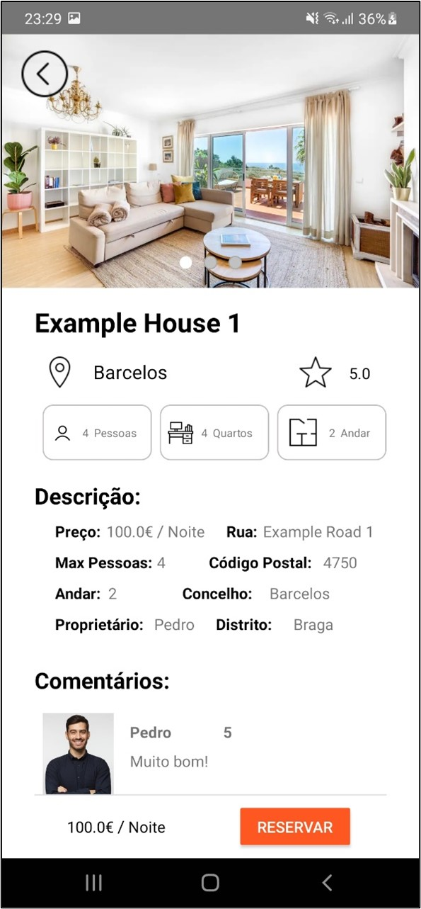

# EzHouse - Android

## IPCA - LESI-PL - Programação de Dispositivos Móveis

## Equipa do Projeto

* Pedro Martins Nº23527
* Luís Anjo Nº23528
* Diogo Silva Nº23893

## Índice

- [Introdução](#introdução)
- [Descrição do Projeto](#descrição-do-projeto)
- [Objetivos de Negócio](#objetivos-de-negócio)
- [Tipos de Utilizadores da Aplicação](#tipos-de-utilizadores-da-aplicação)
- [BackEnd da Aplicação](#backend-da-aplicação)
- [FrontEnd da Aplicação](#frontend-da-aplicação)
- [Instalação](#instalação)
- [Desenvolvimento](#desenvolvimento)
- [Layout das Páginas](#layout-das-páginas)
- [Conclusão](#conclusão)


## Introdução

No âmbito das unidades curriculares de Projeto Aplicado, Programação de Dispositivos Móveis e Integração de Sistemas de Informação foi proposto o desenvolvimento de uma Aplicação Móvel no qual será possível disponibilizar alojamentos locais para reserva, assim como, efetuar a reserva dos mesmos.

<div style="display: flex; justify-content: center;">
    
    
</div>

## Descrição do Projeto

A nossa aplicação móvel servirá para os utilizadores poderem efetuar alugueres de alojamentos e disponibilizar o seu alojamento para aluguer. Os utilizadores do nosso projeto serão pessoas comuns que pretendem efetuar uma reserva em um determinado alojamento seja para viver, férias ou até para um estudante que pretende ingressar na faculdade, tendo este último a oportunidade de alugar um quarto e a possibilidade de partilhar a casa com outros estudantes universitários para que a mesma fique mais barata. 
Os utilizadores da aplicação vão contribuir para a rentabilidade do nosso projeto, uma vez que, ao efetuarem reservas nos alojamentos, iremos receber uma comissão.

## Objetivos de Negócio

* Este projeto irá ajudar as pessoas devido às dificuldades de encontrar espaços de aluguer, estas desconhecem ou não têm um alojamento para alugar, e vai ajudar nesse sentido, dando um passo à frente de outras apps como o “airbnb” ao ter a possibilidade de alugar um quarto compartilhado por parte dos universitários.
* Antes da publicação de um alojamento ou quarto universitário, este irá passar por uma análise do administrador, de forma a manter um estatuto de alojamentos a bom preço em relação à qualidade do produto. Esta análise dará competitividade às plataformas da atualidade.
* Em caso de alguma dúvida, a equipa de suporte estará ativa 24/7 de forma a evitar que os usuários migrem para outras plataformas concorrentes.


## Tipos de Utilizadores da Aplicação

* Utilizador - Representa os utilizadores que pretendem efetuar reservas de alojamentos.
* Anunciante - Representa os utilizadores que pretendem colocar o seu alojamento para aluguer.
* Administrador – Órgãos que gerem a aplicação.

## BackEnd da Aplicação

Para o desenvolvimento da API da nossa plataforma usamos a linguagem de programação C# e a framework .NET 6.0. Foram definidos os endpoints da API (rotas), que serão os caminhos para aceder aos recursos e executar operações específicas. Criamos middlewares para filtrar os acessos aos endpoints.
De forma a priorizar a segurança usamos as bibliotecas jwt e Bcrypt. A biblioteca jwt foi usada para gerir os tokens da plataforma, enquanto a biblioteca Bcrypt foi usada para encriptar a password do utilizador.
Para o armazenamento dos dados da plataforma usamos o SQL. Para o gerenciamento da base de dados usamos o Microsoft SQL Server Management Studio (MSSMS).
Por fim, para que os membros do grupo tenham acesso à base de dados em tempo real, colocamos a mesma online a partir do AzureDevOps.	
- Repositório Api: https://github.com/ISI2324/tp02-03

#### Endereço das API’s

- EzBooking: https://bookapih.azurewebsites.net/ 
- AuthenticationEzBooking: https://authenticationezbooking20231222152833.azurewebsites.net/


## FrontEnd da Aplicação

Para a realização do frontend fizemos uma aplicação com o uso do kotlin que foi integrada com a cadeira “Programação de Dispositivos Móveis”, fizemos chamadas à api para trazer todos os dados que estavam presentes na mesma e usar a lógica da mesma. Usamos também a base de dados online firebase para gerir as notificações na aplicação, tornando o desenvolvimento mais simples e eficaz em comparação à implementação das notificações no backend em SQL.
- Repositório Código: https://github.com/L-Anjo/BookingApp_Kotlin

#### Instalação

Para experimentar a aplicação EZBooking no Android Studio utilize o seguinte comando para Clonar Repositório:

   ```bash
   git clone https://github.com/L-Anjo/BookingApp_Kotlin.git
   ```

# Desenvolvimento

## Layout das Páginas

Para cada Página da Aplicação, começamos por criar um arquivo ".xml" para definir a estrutura e o design da página. Estes arquivos estão localizados na pasta "layout" dentro da pasta "res" do código. 

- Foi criado um arquivo ".xml" para cada activity, com o layout desenhado especidificamente para a página da activity em questão, com o nome por exemplo: "activity_main.xml";

Com o seguinte resultado:

<div style="text-align: center;">
    
</div>

- Foi criado um arquivo ".xml" para cada "row", especificamente utilizado na página da respetiva lista de item, por exemplo: "row_reservation.xml" que foi utilizado na lista das reservas;

- Foi criado um arquivo ".xml" para cada lista de items, por exemplo: "activity_user_reservations_list.xml", onde serão listadas as reservas do utilizador em rows, através do row definido em "row_reservation.xml". Estes foram definidos através de "ListView" como por exemplo:

```xml
    <ListView
        android:id="@+id/listViewHouses"
        android:layout_width="0dp"
        android:layout_height="0dp"
        android:layout_marginTop="16dp"
        app:layout_constraintBottom_toBottomOf="parent"
        app:layout_constraintEnd_toEndOf="parent"
        app:layout_constraintStart_toStartOf="parent"
        app:layout_constraintTop_toBottomOf="@+id/line" />
```

- Nos arquivos "Activity" do código está presente o código que vai fazer a ligação entre os dados que são recebidos da base de dados e a página com a lista de items, que serão colocados em cada "Row" respetivo e por aí enviados para a "ListView" respetiva.

Ficamos assim com o resultado final:

<div style="display: flex; justify-content: center;">
    
    
</div>

### Drawables

Utilizamos a pasta "drawable" para armazenar os drawables utilizados nos layouts como icones ou botões, como no exemplo:

```xml
    <ImageView
        android:id="@+id/imageViewBack"
        android:layout_width="wrap_content"
        android:layout_height="wrap_content"
        android:layout_marginStart="16dp"
        android:layout_marginTop="16dp"
        app:layout_constraintStart_toStartOf="parent"

        app:layout_constraintTop_toTopOf="parent"
        app:srcCompat="@drawable/icons8_back_50" />
```
Aqui foi utilizado um drawable para ser utilizado como icone para o botão de voltar para a página anterior.

- Temos também em páginas a utilização de vários botões que permitem ao utilizador efetuar ações sobre a aplicação, como por exemplo na página de reserva, o botão "Reservar" que inviará o utilizador para a página de reserva:

```xml
        <Button
            android:id="@+id/buttonReservationDetail"
            android:layout_width="wrap_content"
            android:layout_height="wrap_content"
            android:layout_weight="0.2"
            android:backgroundTint="#FF5722"
            android:textColor="@color/white"
            android:text="Reservar" />
```

<div style="text-align: center;">
    
</div>

- Foram também criadas páginas especificas para o Login na aplicação e o Registo, como demonstram os exemplos:

<div style="display: flex; justify-content: center;">
    
    
</div>

# Conclusão

No decorrer deste projeto, tivemos a oportunidade de aplicar de forma prática os conhecimentos adquiridos na Unidade Curricular de Programação de Dispositivos Móveis. Ao longo do desenvolvimento, utilizamos e consolidamos conhecimentos que se revelaram essenciais para ampliar nossas habilidades no contexto de criação de código, especialmente no âmbito do frontend da aplicação. 
A construção de uma App em Kotlin representou um desafio significativo, mas ao mesmo tempo uma oportunidade valiosa para expandir nosso conhecimento.
Em suma, este projeto foi mais do que a aplicação de conhecimentos teóricos, foi uma oportunidade para aprimorar habilidades práticas e desenvolver um entendimento mais profundo das nuances do desenvolvimento de frontend para Android de uma aplicação.
